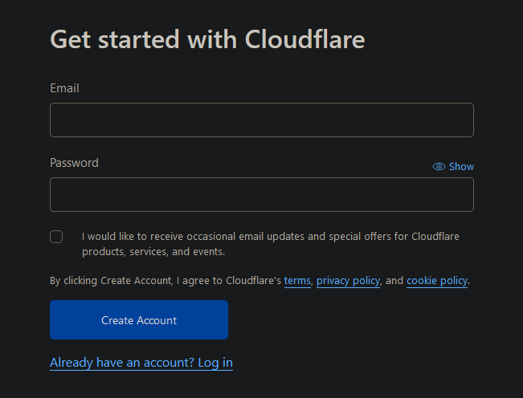

# High-Available k3s-Cluster using Hetzner Cloud

# Introduction
In this repo you find a step by step solution to deploy a high-available, auto scalable and loadbalanced [k3s](https://k3s.io/) cluster to servers inside the Hetzner-Cloud.  
This repo covers:
* Setting up all prerequisites on the hetzner cloud and local machine
* Installation and configuration of the hetzner cloud components (placement groups, networks, servers, load balancers)
* Configuration of hetzner load balancer to load balance the kubernetes api and the default service ingress
* Installation and configuration of k3s servers (controlplane) and agents (workers)
* Setup Hetzner Cloud Controller Manager to interact with hetzner cloud api
* Setup Hetzner Storage Driver to use hetzner cloud volumes as persistent volume claim
* Setup system-upgrade controller to do easy updates with predefined update plans
* Setup traefik as ingress-controller
* Setup cert-manager to get certificates from lets encrypt
* Deploy metrics-server to collect metrics from pods and nodes
* Setup cluster autoscaler with hetzner cloud provider to autoscale worker nodes if running out of compute power
* Give an example for horizontal pod autoscaling to start new pods if compute power from one pod exceeded

# ToDo
* Deploy kube-prometheus-stack (prometheus, grafana, alertmanager, node-exporter etc.) to collect and visualize metrics from nodes and pods
* Setup vertical pod autoscaler to automaticly update pod resources requests and limits
* Setup goldilocks as dashboard for the vertical pod autoscaler
* Setup argo-cd to automaticly deploy workloads as part of the ci/cd pipeline

# Steps
1. [Prerequisites](#1-prerequisites)  
1.1. [Hetzner](#11-hetzner)  
1.1.1. [create cloud account](#111-create-cloud-account)  
1.1.2. [create project](#112-create-project)  
1.1.3. [create API token(s)](#113-create-api-tokens)  
1.1.4. [upload ssh-key(s)](#114-upload-ssh-keys)  
1.2. [container repository](#12-container-repository)  
1.2.1. [create account](#121-create-account)  
1.2.2. [create token](#122-create-token)  
1.3. [dns provider](#13-dns-provider)  
1.3.1. [create account](#131-create-account)  
1.3.2. [setup sites and dns records](#132-setup-sites-and-dns-records)  
1.3.3. [create token](#133-create-token)  
1.4. [Local machine](#14-local-machine)  
1.4.1. [hcloud](#141-hcloud)  
1.4.1.1. [install hcloud](#1411-install-hcloud)  
1.4.1.2. [setup hcloud context](#1412-setup-hcloud-context)  
1.4.2. [Helm](#142-helm)  
1.4.3. [kubectl](#143-kubectl)  
2. [Installation](#2-installation)  
2.1. [Hetzner](#21-hetzner)  
2.1.1. [create placement groups](#211-create-placement-groups)  
2.1.2. [create private network](#212-create-private-network)  
2.1.3. [create servers](#213-create-servers)  
2.1.4. [create load balancers](#214-create-load-balancers)  
2.2. [servers](#22-servers)  
2.2.1. [install updates](#221-install-updates)  
2.2.2. [set timezone](#222-set-timezone)  
2.2.3. [install packages](#223-install-packages)  
2.3. [k3s](#23-k3s)  
2.3.1. [control-plane](#231-control-plane)  
2.3.1.1. [install first server](#2311-install-first-server)  
2.3.1.2. [install other servers](#2312-install-other-servers)  
2.3.2. [setup kubectl](#232-setup-kubectl)  
3. [Deployments](#3-deployments)  
3.1. [cloud-controller-manager](#31-cloud-controller-manager)  
3.1.1. [setup secret](#311-setup-secret)  
3.1.2. [deploy ccm](#312-deploy-ccm)  
3.2. [cloud-volume driver](#32-cloud-volume-driver)  
3.2.1. [setup secret](#321-setup-secret)  
3.2.2. [deploy hcloud-csi](#322-deploy-hcloud-csi)  
3.3. [deploy upgrade-controller](#33-deploy-upgrade-controller)  
3.4. [traefik](#34-traefik)  
3.4.1. [prerequisites](#341-prerequisites)  
3.4.2. [configure helm values](#342-configure-helm-values)  
3.4.3. [deploy workload](#343-deploy-workload)  
3.4.4. [setup default middleware](#344-setup-default-middleware)  
3.4.5. [dashboard](#345-dashboard)  
3.4.5.1. [create basic auth](#3451-create-basic-auth)  
3.4.5.2. [setup middleware](#3452-setup-middleware)  
3.4.5.3. [create IngressRoute](#34543-create-ingressroute)  
3.5. [cert-manager](#35-cert-manager)  
3.5.1. [prerequisites](#351-prerequisites)  
3.5.2. [configure helm values](#352-configure-helm-values)  
3.5.3. [deploy workload](#353-deploy-workload)  
3.5.4. [certificates](#354-certificates)  
3.5.4.1. [create Cloudflare token](#3541-create-cloudflare-token)  
3.5.4.2. [letsencrypt staging](#3542-letsencrypt-staging)  
3.5.4.2.1. [create CertificateIssuer](#35421-create-certificateissuer)  
3.5.4.2.2. [create Certificate](#35422-create-certificate)  
3.5.4.2.3. [add certificate to traefik](#35423-add-certificate-to-traefik)  
3.5.4.3. [letsencrypt production](#3543-letsencrypt-production)  
3.5.4.3.1. [create CertificateIssuer](#35431-create-certificateissuer)  
3.5.4.3.2. [create Certificate](#35432-create-certificate)  
3.5.4.3.3. [add certificate to traefik](#35433-add-certificate-to-traefik)  
3.6. [deploy metrics-server](#36-deploy-metrics-server)  
3.7. [cluster-autoscaler](#37-cluster-autoscaler)  
3.7.1. [create cloud-init configuration](#371-create-cloud-init-configuration)  
3.7.2. [create secret](#372-create-secret)  
3.7.3. [create autoscaler image](#373-create-autoscaler-image)  
3.7.4. [create repository secret](#374-create-repository-secret)  
3.7.5. [configure deployment](#375-configure-deployment)  
3.7.6. [deploy workload](#376-deploy-workload)  
3.8. [example horizontal pod autoscaler](#38-example-horizontal-pod-autoscaler)  
3.8.1. [example application](#381-example-application)  
3.8.2. [scale pods](#382-scale-pods)  
3.8.3. [delete deployment](#383-delete-deployment)  

# 1. Prerequisites
## 1.1. Hetzner
### 1.1.1. create cloud account
Create an account at the Hetzner Cloud Hosting portal.  
You can use [my ref-link](https://hetzner.cloud/?ref=QVP9EsLHwtNY) to get 20€ for free if you want. 

### 1.1.2. create project
The autoscale cluster should sit in a **plain cloud project**.  
Login at [console.hetzner.cloud/projects](https://console.hetzner.cloud/projects) and create new project.  
The name of the project doesn't matter.  


### 1.1.3. create API token(s)
Open the project and go to security and the api-tokens tab.  
Here you have to create **at least one api-token**.  
I created several ones to keep the different services seperated and logged what which service does. 
I created the following tokens:
* `hcloud-cli` (used for hcloud cli application on local machine)
* `hcloud-csi` (used for persistent volume driver)
* `ccm` (used for cloud-controller-manager)
* `cluster-autoscaler` (used for cluster autoscaler)  

All tokens need read and write access.  
Save them in a **secure place** you will need them later and cant view them another time inside the webpanel.


### 1.1.4. upload ssh-key(s)
Stay inside the security part of the hetzner webinterface and open the tab for the ssh-keys.  
Click add to upload your ssh-key(s). Paste your public key to the window.  
They will be later added to the servers when we create them. 
If you want to create a new ssh-key you can use `ssh-keygen`. 

## 1.2. container repository
You need an account at a container repository. You can use for example the [docker-hub](https://hub.docker.com/) or the [github-container-repository]().  
In this example, I will use the docker-hub. 

### 1.2.1. create account
First, create an account at your container-repository provider.  
If you want to use a docker-hub account, you can register [here](https://hub.docker.com/signup).


### 1.2.2. create token
If you want to use private repositories you have to create an access token to pull the private images from the kubernetes host.  

If you use docker, move to your [security-profile-page](https://hub.docker.com/settings/security) and create an access-token.  
You can name the token whatever you want. The token only needs read access to pull the images. Be shure to save the token in a save place because you need it later in the setup.  


## 1.3. dns provider
To use ssl-certificates later, we will use the cert-manager from kubernetes with lets-encrypt certificates. To use this, we need a dns provider for our domain that supports dns01-validation via acme. You can find supported dns providers in the [documentation from the kubernetes cert-manager](https://cert-manager.io/docs/configuration/acme/dns01/#supported-dns01-providers).  
In this tutorial i will use [CloudFlare](https://cloudflare.com)

### 1.3.1. create account
First, you have to create an account at your dns-provider.  
If you want to use CloudFlare, you can create an account [here](https://dash.cloudflare.com/sign-up). 



### 1.3.2. setup sites and dns records
After creating an account you have to add your domain as a new site to your dns provider.  
After that you can import your old dns entries or add new ones.  
As final step you need to change the nameservers from your domain. You can do this normally in the control panel from your domain hoster.  
Because these steps are different from dns provider to dns provider and different from domain hoster to domain hoster, I will skip this part in this tutorial. 

### 1.3.3. create token
To use the dns01-challenge, the acme client will create a txt dns-record for you to validate that you own the requested domain. To change the dns settings (add an entry) you have to create an access token for the acme client.  

If you use CloudFlare, move to your [api-token-profile-page](https://dash.cloudflare.com/profile/api-tokens) and create a new api-token. Dont use the global api token, you need a new api-token for your specific dns-zone.   
As token-template you can use the edit-dns-zone setting. In the next step you have to select your site you have created in step [1.3.2](#132-setup-sites-and-dns-records). Remember to save the token, it will not be shown again. 

## 1.4. local machine
In the last preparation step, we have to setup our local machine. As local machine you need a linux-host. You can install it directy to your host, use a virtual machine or - as i do - use wsl, the windows subsystem for linux.  

### 1.4.1. hcloud
To control the hetzner cloud from the command line you need hcloud, a tool by hetzner. You can find more information [here](https://github.com/hetznercloud/cli).

#### 1.4.1.1. install hcloud
You can install hcloud with [homebrew](https://brew.sh/).  
Run `brew install hcloud` to install hcloud to your system. 

#### 1.4.1.2. setup hcloud context
To communicate with your hetzner cloud project from step [1.1.2](#112-create-project) you created an api-token in step [1.1.3](#113-create-api-tokens). In my example i named it `hcloud-cli`.  
To link the cloud project with the hcloud application by using the api-token, you have to create an hcloud-context. You can manage different cloud-projects with different contexts.  
To create a new context type `hcloud context create [NAME]` and paste your previously saved api-token.  
You can see all contexts with `hcloud context list` and set your used context with `hcloud context use [NAME]`. 

### 1.4.2. Helm
To install packages to kubernetes you need helm on your local machine.  
To install helm, visit the [official installation manual](https://helm.sh/docs/intro/install/#from-script). 

### 1.4.3. kubectl
To administrate the kubernetes cluster you also need kubectl, a command line interface to control kubernetes clusters.  
You can visit the [kubernets documentation](https://kubernetes.io/docs/tasks/tools/install-kubectl-linux/#install-kubectl-binary-with-curl-on-linux) for installation steps.  

# 2. Installation
In this step we will install the kubernetes cluster and all needed components.

## 2.1. Hetzner
To provide servers, a network-connection and load-balancers we will use the hetzner cloud. In this step we will create all parts for the hetzner infrastructure. 

### 2.1.1. create placement groups
To separate all servers from each other, we will create placement groups for the servers. One placement group will be for one server-role for one location.  
To create all placement groups, run the following commands on your local machine:  
```bash
hcloud placement-group create --type spread --name k8s-control_plane-hel1 --label k8s-role=control_plane --label location=hel1

hcloud placement-group create --type spread --name k8s-control_plane-fsn1 --label k8s-role=control_plane --label location=fsn1

hcloud placement-group create --type spread --name k8s-control_plane-nbg1 --label k8s-role=control_plane --label location=nbg1
```
The commands will create a placement group for each hetzner location with the name `k8s-control_plane-[LOCATION]` and the labels `k8s-role=control_plane` and `location=[LOCATION]`.  

To create the placement groups for all agents, run these commands on your local machine:
```bash
hcloud placement-group create --type spread --name k8s-agent-hel1 --label k8s-role=agent --label location=hel1

hcloud placement-group create --type spread --name k8s-agent-fsn1 --label k8s-role=agent --label location=fsn1

hcloud placement-group create --type spread --name k8s-agent-nbg1 --label k8s-role=agent --label location=nbg1
```
The commands will create a placement group for each hetzner location with the name `k8s-agent-[LOCATION]` and the labels `k8s-role=agent` and `location=[LOCATION]` similar to the commands for the controlplane.

### 2.1.2. create private network
To create the private network for the servers run the following command on your local machine:
```bash
hcloud network create --name k8s --ip-range 10.0.0.0/8 --label k8s-role=control_plane-agent --label location=hel1-fsn1-nbg1
```
The command will create a network with the name `k8s` and the labels `k8s-role=control_plane-agent` and `location=hel1-fsn1-nbg1`.

To create the separate subnets inside this network, run the following commands on your local machine:
```bash
hcloud network add-subnet k8s --network-zone eu-central --type cloud --ip-range 10.0.0.0/24 # load_balancer control_plane and agent

hcloud network add-subnet k8s --network-zone eu-central --type cloud --ip-range 10.1.0.0/24 # control_plane hel1

hcloud network add-subnet k8s --network-zone eu-central --type cloud --ip-range 10.1.1.0/24 # control_plane fsn1

hcloud network add-subnet k8s --network-zone eu-central --type cloud --ip-range 10.1.2.0/24 # control_plane nbg1

hcloud network add-subnet k8s --network-zone eu-central --type cloud --ip-range 10.2.0.0/24 # agent hel1

hcloud network add-subnet k8s --network-zone eu-central --type cloud --ip-range 10.2.1.0/24 # agent fsn1

hcloud network add-subnet k8s --network-zone eu-central --type cloud --ip-range 10.2.2.0/24 # agent nbg1
```
The commands will create the following subnets:
  * 10.0.0.0/24 for the load balancers for the controlplane and agents
  * 10.1.0.0/24 for the controlplane in hel1
  * 10.1.1.0/24 for the controlplane in fsn1
  * 10.1.2.0/24 for the controlplane in nbg1
  * 10.2.0.0/24 for the agents in hel1
  * 10.2.1.0/24 for the agents in fsn1
  * 10.2.2.0/24 for the agents in nbg1

### 2.1.3. create servers
To create the servers for the control plane, run the following commands on your local machine:
```bash
hcloud server create --datacenter hel1-dc2 --image debian-11 --ssh-key k8s_ssh_key --type cx21 --placement-group k8s-control_plane-hel1 --name k8s-controlplane-hel1-1 --label k8s-role=control_plane --label location=hel1

hcloud server create --datacenter fsn1-dc14 --image debian-11 --ssh-key k8s_ssh_key --type cx21 --placement-group k8s-control_plane-fsn1 --name k8s-controlplane-fsn1-1 --label k8s-role=control_plane --label location=fsn1

hcloud server create --datacenter nbg1-dc3 --image debian-11 --ssh-key k8s_ssh_key --type cx21 --placement-group k8s-control_plane-nbg1 --name k8s-controlplane-nbg1-1 --label k8s-role=control_plane --label location=nbg1
```
The commands will create a control plane node in each hetzner location with...
  * the name `k8s-controlplane-[LOCATION]-1`
  * the server type CX21 (2 cores, 4gb ram)
  * the image debian-11
  * the ssh-key added in step [1.1.4](#114-upload-ssh-keys)
  * the placement-groups created in step [2.1.1](#211-create-placement-groups)
  * and the labels `k8s-role=control_plane` and `location=[LOCATION]`.

To add the servers to the private network, run the following commands on your local machine:
```bash
hcloud server attach-to-network k8s-controlplane-hel1-1 --network k8s --ip 10.1.0.1
hcloud server attach-to-network k8s-controlplane-fsn1-1 --network k8s --ip 10.1.1.1
hcloud server attach-to-network k8s-controlplane-nbg1-1 --network k8s --ip 10.1.2.1
```
The commands will add the servers to the private network `k8s` and assign the following ips:
  * 10.1.0.1 to the control plane in hel1
  * 10.1.1.1 to the control plane in fsn1
  * 10.1.2.1 to the control plane in nbg1

See also network creation in step [2.1.2](#212-create-private-network).

### 2.1.4. create load balancers
Kubernetes needs two loadbalancers. One for the control plane and one for the hosted services. In this setup we will use external hardware loadbalancers from the hetzner cloud.  
So in this step we will create the loadbalancers for the control plane and the hosted services with executing the following commands on your local machine:
```bash
hcloud load-balancer create --algorithm-type round_robin --location fsn1 --name k8s-controlplane --type lb11 --label k8s-role=control_plane --label location=fsn1

hcloud load-balancer attach-to-network k8s-controlplane --network k8s --ip 10.0.0.100

hcloud load-balancer create --algorithm-type round_robin --location nbg1 --name k8s-agent --type lb11 --label k8s-role=agent --label location=nbg1

hcloud load-balancer attach-to-network k8s-agent --network k8s --ip 10.0.0.200

hcloud load-balancer add-target k8s-controlplane --label-selector k8s-role=control_plane --use-private-ip

hcloud load-balancer add-service k8s-controlplane --destination-port 6443 --listen-port 6443 --protocol tcp

hcloud load-balancer add-target k8s-agent --label-selector k8s-role=agent --use-private-ip
```
The commands will create the following loadbalancers and configurations:
  * loadbalancer for the controlplane inside the location fsn1 with the private ip 10.0.0.100 using all all k8s-controlplanes on port 6443
  * loadbalancer for the agents inside the location nbg1 with the private ip 10.0.0.200 using all agent-nodes. Services will be added later by the kubernetes cloud controller manager. 

## 2.2. servers
### 2.2.1. install updates
### 2.2.2. set timezone
### 2.2.3. install packages
## 2.3. k3s
### 2.3.1. control-plane
#### 2.3.1.1. install first server
#### 2.3.1.2. install other servers
### 2.3.2. setup kubectl

# 3. Deployment
## 3.1. cloud-controller-manager
### 3.1.1. setup secret
### 3.1.2. deploy ccm
## 3.2. cloud-volume driver
### 3.2.1. setup secret
### 3.2.2. deploy hcloud-csi
## 3.3. deploy upgrade-controller
## 3.4. traefik
### 3.4.1. prerequisites
### 3.4.2. configure helm values
### 3.4.3. deploy workload
### 3.4.4. setup default middleware
### 3.4.5. dashboard
#### 3.4.5.1. create basic auth
#### 3.4.5.2. setup middleware
#### 3.4.5.3. create IngressRoute
## 3.5. cert-manager
### 3.5.1. prerequisites
### 3.5.2. configure helm values
### 3.5.3. deploy workload
### 3.5.4. certificates
#### 3.5.4.1. create Cloudflare token
#### 3.5.4.2. letsencrypt staging
##### 3.5.4.2.1. create CerificateIssuer
##### 3.5.4.2.2. create Certificate
##### 3.5.4.2.3. add certificate to traefik
#### 3.5.4.3. letsencrypt production
##### 3.5.4.3.1. create CerificateIssuer
##### 3.5.4.3.2. create Certificate
##### 3.5.4.3.3. add certificate to traefik
## 3.6. deploy metrics-server
## 3.7. cluster-autoscaler
### 3.7.1. create cloud-init configuration
### 3.7.2. create secret
### 3.7.3. create autoscaler image
### 3.7.4. create repository secret
### 3.7.5. configure deployment
### 3.7.6. deploy workload
## 3.8. example horizontal pod autoscaler
### 3.8.1. example application
### 3.8.2. scale pods
### 3.8.3. delete deployment

# Credits
Huge thank you to many people and git repos where I got my information and commands from.  
Special thanks to:
* [Techno Tim](https://github.com/techno-tim)
* [The DevOps Guy](https://github.com/marcel-dempers)
* [Hetzner Development Team](https://github.com/hetznercloud/)