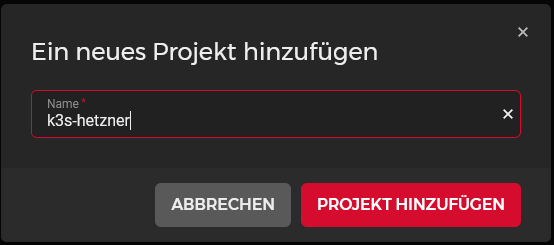
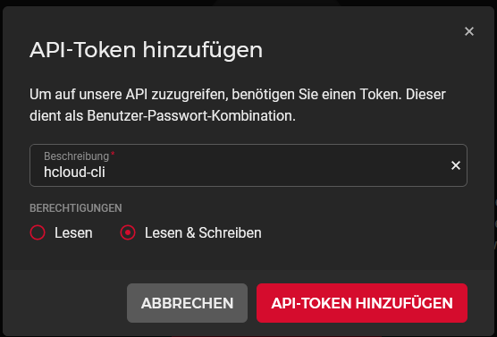

# High-Available k3s-Cluster using Hetzner Cloud

# Introduction
In this repo you find a step by step solution to deploy a high-available, auto scalable and loadbalanced [k3s](https://k3s.io/) cluster to servers inside the Hetzner-Cloud.  
This repo covers:
* Setting up all prerequisites on the hetzner cloud and local machine
* Installation and configuration of the hetzner cloud components (placement groups, networks, servers, load balancers)
* Configuration of hetzner load balancer to load balance the kubernetes api and the default service ingress
* Installation and configuration of k3s servers (controlplane) and agents (workers)
* Setup Hetzner Cloud Controller Manager to interact with hetzner cloud api
* Setup Hetzner Storage Driver to use hetzner cloud volumes as persistent volume claim
* Setup system-upgrade controller to do easy updates with predefined update plans
* Setup traefik as ingress-controller
* Setup cert-manager to get certificates from lets encrypt
* Deploy metrics-server to collect metrics from pods and nodes
* Setup cluster autoscaler with hetzner cloud provider to autoscale worker nodes if running out of compute power
* Give an example for horizontal pod autoscaling to start new pods if compute power from one pod exceeded

# ToDo
* Deploy kube-prometheus-stack (prometheus, grafana, alertmanager, node-exporter etc.) to collect and visualize metrics from nodes and pods
* Setup vertical pod autoscaler to automaticly update pod resources requests and limits
* Setup goldilocks as dashboard for the vertical pod autoscaler
* Setup argo-cd to automaticly deploy workloads as part of the ci/cd pipeline

# Steps
1. [Prerequisites](#1-prerequisites)  
1.1. [Hetzner](#11-hetzner)  
1.1.1. [create cloud account](#111-create-cloud-account)  
1.1.2. [create project](#112-create-project)  
1.1.3. [create API token(s)](#113-create-api-tokens)  
1.1.4. [upload ssh-key(s)](#113-upload-ssh-keys)  
1.2. [container repository](#12-container-repository)  
1.2.1. [create account](#121-create-account)  
1.2.2. [create token](#122-create-token)  
1.3. [dns provider](#13-dns-provider)  
1.3.1. [create account](#131-create-account)  
1.3.2. [create token](#132-create-token)  
1.4. [Local machine](#14-local-machine)  
1.4.1. [hcloud](#141-hcloud)  
1.4.1.1. [install hcloud](#1411-install-hcloud)  
1.4.1.2. [setup hcloud context](#1412-setup-hcloud-context)  
1.4.2. [Helm](#142-helm)  
1.4.3. [kubectl](#143-kubectl)  
2. [Installation](#2-installation)  
2.1. [Hetzner](#21-hetzner)  
2.1.1. [create placement groups](#211-create-placement-groups)  
2.1.2. [create private network](#212-create-private-network)  
2.1.3. [create servers](#213-create-servers)  
2.1.4. [create load balancers](#214-create-load-balancers)  
2.2. [servers](#22-servers)  
2.2.1. [install updates](#221-install-updates)  
2.2.2. [set timezone](#222-set-timezone)  
2.2.3. [install packages](#223-install-packages)  
2.3. [k3s](#23-k3s)  
2.3.1. [control-plane](#231-control-plane)  
2.3.1.1. [install first server](#2311-install-first-server)  
2.3.1.2. [install other servers](#2312-install-other-servers)  
2.3.2. [setup kubectl](#232-setup-kubectl)  
3. [Deployments](#3-deployments)  
3.1. [cloud-controller-manager](#31-cloud-controller-manager)  
3.1.1. [setup secret](#311-setup-secret)  
3.1.2. [deploy ccm](#312-deploy-ccm)  
3.2. [cloud-volume driver](#32-cloud-volume-driver)  
3.2.1. [setup secret](#321-setup-secret)  
3.2.2. [deploy hcloud-csi](#322-deploy-hcloud-csi)  
3.3. [deploy upgrade-controller](#33-deploy-upgrade-controller)  
3.4. [traefik](#34-traefik)  
3.4.1. [prerequisites](#341-prerequisites)  
3.4.2. [configure helm values](#342-configure-helm-values)  
3.4.3. [deploy workload](#343-deploy-workload)  
3.4.4. [setup default middleware](#344-setup-default-middleware)  
3.4.5. [dashboard](#345-dashboard)  
3.4.5.1. [create basic auth](#3451-create-basic-auth)  
3.4.5.2. [setup middleware](#3452-setup-middleware)  
3.4.5.3. [create IngressRoute](#34543-create-ingressroute)  
3.5. [cert-manager](#35-cert-manager)  
3.5.1. [prerequisites](#351-prerequisites)  
3.5.2. [configure helm values](#352-configure-helm-values)  
3.5.3. [deploy workload](#353-deploy-workload)  
3.5.4. [certificates](#354-certificates)  
3.5.4.1. [create Cloudflare token](#3541-create-cloudflare-token)  
3.5.4.2. [letsencrypt staging](#3542-letsencrypt-staging)  
3.5.4.2.1. [create CertificateIssuer](#35421-create-certificateissuer)  
3.5.4.2.2. [create Certificate](#35422-create-certificate)  
3.5.4.2.3. [add certificate to traefik](#35423-add-certificate-to-traefik)  
3.5.4.3. [letsencrypt production](#3543-letsencrypt-production)  
3.5.4.3.1. [create CertificateIssuer](#35431-create-certificateissuer)  
3.5.4.3.2. [create Certificate](#35432-create-certificate)  
3.5.4.3.3. [add certificate to traefik](#35433-add-certificate-to-traefik)  
3.6. [deploy metrics-server](#36-deploy-metrics-server)  
3.7. [cluster-autoscaler](#37-cluster-autoscaler)  
3.7.1. [create cloud-init configuration](#371-create-cloud-init-configuration)  
3.7.2. [create secret](#372-create-secret)  
3.7.3. [create autoscaler image](#373-create-autoscaler-image)  
3.7.4. [create repository secret](#374-create-repository-secret)  
3.7.5. [configure deployment](#375-configure-deployment)  
3.7.6. [deploy workload](#376-deploy-workload)  
3.8. [example horizontal pod autoscaler](#38-example-horizontal-pod-autoscaler)  
3.8.1. [example application](#381-example-application)  
3.8.2. [scale pods](#382-scale-pods)  
3.8.3. [delete deployment](#383-delete-deployment)  

# 1. Prerequisites
## 1.1. Hetzner
### 1.1.1. create cloud account
Create an account at the Hetzner Cloud Hosting portal.  
You can use [my ref-link](https://hetzner.cloud/?ref=QVP9EsLHwtNY) to get 20€ for free if you want. 

### 1.1.2. create project
The autoscale cluster should sit in a **plain cloud project**.  
Login at [console.hetzner.cloud/projects](https://console.hetzner.cloud/projects) and create new project.  
The name of the project doesn't matter.  

### 1.1.3. create API token(s)
Open the project and go to security and the api-tokens tab.  
Here you have to create **at least one api-token**.  
I created several ones to keep the different services seperated and logged what which service does. 
I created the following tokens:
* `hcloud-cli` (used for hcloud cli application on local machine)
* `hcloud-csi` (used for persistent volume driver)
* `ccm` (used for cloud-controller-manager)
* `cluster-autoscaler` (used for cluster autoscaler)  

All tokens need read and write access.  
Save them in a **secure place** you will need them later and cant view them another time inside the webpanel.

### 1.1.4. upload ssh-key(s)
Stay inside the security part of the hetzner webinterface and open the tab for the ssh-keys.  
Click add to upload your ssh-key(s). Paste your public key to the window.  
They will be later added to the servers when we create them. 
If you want to create a new ssh-key you can use `ssh-keygen`. 

## 1.2. container repository
You need an account at a container repository. You can use for example the [docker-hub](https://hub.docker.com/) or the [github-container-repository]().  
In this example, I will use the docker-hub. 

### 1.2.1. create account
First, create an account at your container-repository provider.  
If you want to use a docker-hub account, you can register [here](https://hub.docker.com/signup).

### 1.2.2. create token
If you want to use private repositories you have to create an access token to pull the private images from the kubernetes host.  

If you use docker, move to your [security-profile-page](https://hub.docker.com/settings/security) and create an access-token.  
You can name the token whatever you want. The token only needs read access to pull the images. Be shure to save the token in a save place because you need it later in the setup.  

## 1.3. dns provider
### 1.3.1. create account
### 1.3.2. create token
## 1.4. local machine
### 1.4.1. hcloud
#### 1.4.1.1. install hcloud
#### 1.4.1.2. setup hcloud context
### 1.4.2. Helm
### 1.4.3. kubectl

# 2. Installation
## 2.1. Hetzner
### 2.1.1. create placement groups
### 2.1.2. create private network
### 2.1.3. create servers
### 2.1.4. create load balancers
## 2.2. servers
### 2.2.1. install updates
### 2.2.2. set timezone
### 2.2.3. install packages
## 2.3. k3s
### 2.3.1. control-plane
#### 2.3.1.1. install first server
#### 2.3.1.2. install other servers
### 2.3.2. setup kubectl

# 3. Deployment
## 3.1. cloud-controller-manager
### 3.1.1. setup secret
### 3.1.2. deploy ccm
## 3.2. cloud-volume driver
### 3.2.1. setup secret
### 3.2.2. deploy hcloud-csi
## 3.3. deploy upgrade-controller
## 3.4. traefik
### 3.4.1. prerequisites
### 3.4.2. configure helm values
### 3.4.3. deploy workload
### 3.4.4. setup default middleware
### 3.4.5. dashboard
#### 3.4.5.1. create basic auth
#### 3.4.5.2. setup middleware
#### 3.4.5.3. create IngressRoute
## 3.5. cert-manager
### 3.5.1. prerequisites
### 3.5.2. configure helm values
### 3.5.3. deploy workload
### 3.5.4. certificates
#### 3.5.4.1. create Cloudflare token
#### 3.5.4.2. letsencrypt staging
##### 3.5.4.2.1. create CerificateIssuer
##### 3.5.4.2.2. create Certificate
##### 3.5.4.2.3. add certificate to traefik
#### 3.5.4.3. letsencrypt production
##### 3.5.4.3.1. create CerificateIssuer
##### 3.5.4.3.2. create Certificate
##### 3.5.4.3.3. add certificate to traefik
## 3.6. deploy metrics-server
## 3.7. cluster-autoscaler
### 3.7.1. create cloud-init configuration
### 3.7.2. create secret
### 3.7.3. create autoscaler image
### 3.7.4. create repository secret
### 3.7.5. configure deployment
### 3.7.6. deploy workload
## 3.8. example horizontal pod autoscaler
### 3.8.1. example application
### 3.8.2. scale pods
### 3.8.3. delete deployment

# Credits
Huge thank you to many people and git repos where I got my information and commands from.  
Special thanks to:
* [Techno Tim](https://github.com/techno-tim)
* [The DevOps Guy](https://github.com/marcel-dempers)
* [Hetzner Development Team](https://github.com/hetznercloud/)