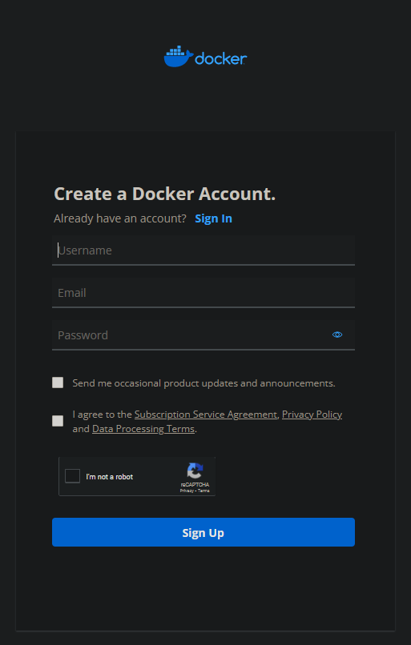
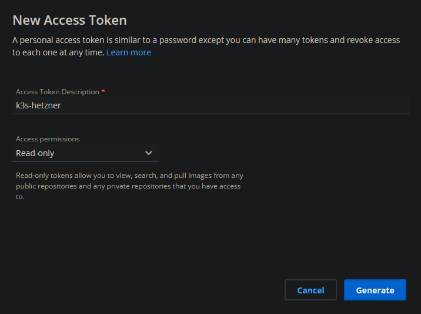

# Container Registry
To provide docker container images for the cluster you will need a container registry.  
In this example i will use the [docker-hub](https://hub.docker.com/) but feel free to use other platforms like [github-container-registry](https://docs.github.com/en/packages/working-with-a-github-packages-registry/working-with-the-container-registry) or something else.  

## Create Account
First, create an account at your container-registry provider. If you already have one, you can skip this step.  
If you want to use a docker-hub account, you can register [here](https://hub.docker.com/signup).

## Create Token
To access the registry and push or pull images (pull only of you use private images) you will need a token.

If you use the docker-hub, move to your [security-profile-page](https://hub.docker.com/settings/security) for the token creation.  
The names of the tokens are not important, but you should know which token is for which purpose.  

!!! note "Reminder"
    Be shure to save the token in a save place because you need it later in the setup.  
    The token is only shown once. 

You will need to create the following tokens:

  * `local-machine` with **write-access** used for your local machine to push the created images

If you want to use private images you also need to create a token for the cluster to pull the images: 

  * `k3s-hetzner` with **read-access** used on the kubernetes hosts to pull the images from the container registry

