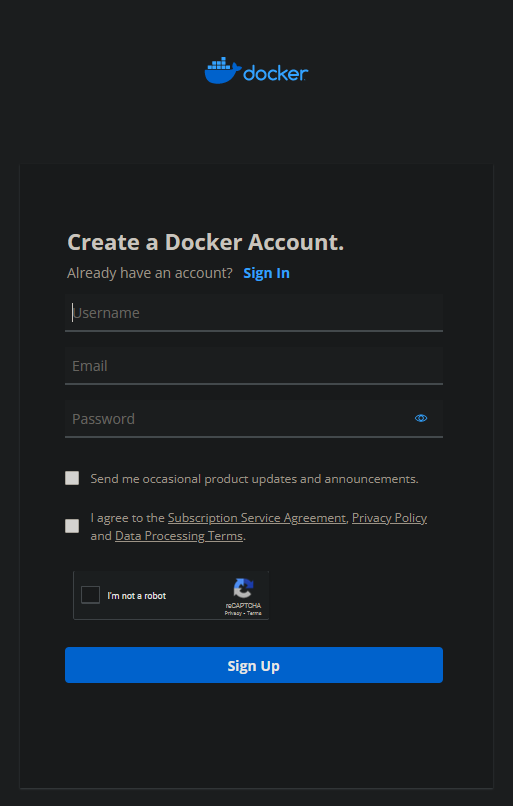
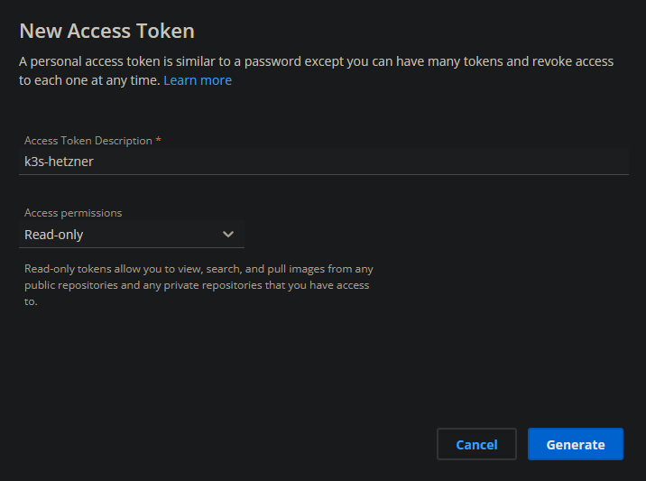

# Container Repository
You need an account at a container repository. You can use for example the [docker-hub](https://hub.docker.com/) or the github-container-repository.  
In this example, I will use the docker-hub. 

## create account
First, create an account at your container-repository provider.  
If you want to use a docker-hub account, you can register [here](https://hub.docker.com/signup).

## create token

**ATTENTION:** Currently its not clear why you need the token, because passwords used later in the processes. This will be checked soon. 

If you want to use private repositories you have to create an access token to pull the private images from the kubernetes host.  

If you use docker, move to your [security-profile-page](https://hub.docker.com/settings/security) and create an access-token.  
You can name the token whatever you want. The token only needs read access to pull the images. Be shure to save the token in a save place because you need it later in the setup.  

