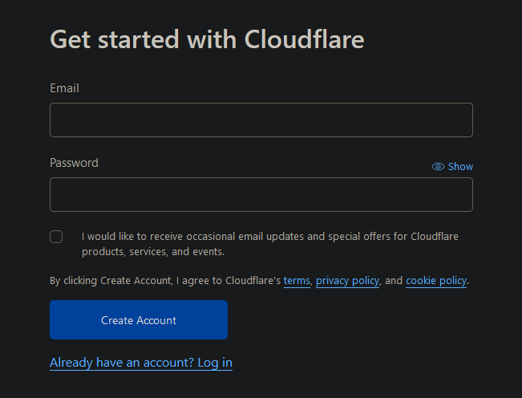

# DNS Provider
To use ssl-certificates later, we will use the cert-manager from kubernetes with lets-encrypt certificates. To use this, we need a dns provider for our domain that supports dns01-validation via acme. You can find supported dns providers in the [documentation from the kubernetes cert-manager](https://cert-manager.io/docs/configuration/acme/dns01/#supported-dns01-providers).  
In this tutorial i will use [CloudFlare](https://cloudflare.com)

## create account
First, you have to create an account at your dns-provider.  
If you want to use CloudFlare, you can create an account [here](https://dash.cloudflare.com/sign-up). 

## setup sites and dns records
After creating an account you have to add your domain as a new site to your dns provider.  
After that you can import your old dns entries or add new ones.  
As final step you need to change the nameservers from your domain. You can do this normally in the control panel from your domain hoster.  
Because these steps are different from dns provider to dns provider and different from domain hoster to domain hoster, I will skip this part in this tutorial. 

## create token
To use the dns01-challenge, the acme client will create a txt dns-record for you to validate that you own the requested domain. To change the dns settings (add an entry) you have to create an access token for the acme client.  

If you use CloudFlare, move to your [api-token-profile-page](https://dash.cloudflare.com/profile/api-tokens) and create a new api-token. Dont use the global api token, you need a new api-token for your specific dns-zone.   
As token-template you can use the edit-dns-zone setting. In the next step you have to select your site you have created in [the previous step](#setup-sites-and-dns-records). Remember to save the token, it will not be shown again. 