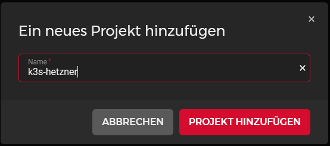
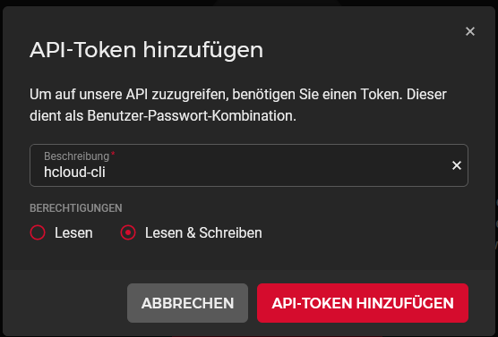

# Hetzner
We will use the hetzner cloud as cheap and easy cloud provider.  
To get everything working we need to create an account and a brandnew cloud project. The project needs new api-tokens and your ssh-key.  
We will cover the single steps in this section.

## Create Hetzner Account
As first step you will need an account at hetzner.  
You can use [my ref-link](https://hetzner.cloud/?ref=QVP9EsLHwtNY) to get 20 EUR for free if you want.  
If you already have an account you can skip this step. 

## Account Limits
The hetzner cloud has limits for every resource you buy.  
You can request a scaleup for your account if you need more resources.  
You can do this on the [limit overview page](https://console.hetzner.cloud/limits) at the top right button.  
You will need to provide a reason for the scaleup.  

Remember that an autoscaling cluster will need at minimum the following resources:

* min. 4x Server (3x server, 1x agent) or more if you need more agents
* 2x LoadBalancer
* number of volumes you want to use
* number of snapshots you want to make 

## Create Project
The autoscaling cluster should sit in a **plain cloud project**.  
Login at [console.hetzner.cloud/projects](https://console.hetzner.cloud/projects) with your previously created account and create new project.  
You can name the project whatever you like. 

## Create API-Token(s)
The different applications and deployments will all need api-tokens to comminicate with the hetzner cloud.  
To create tokens open the project and go to security and the api-tokens tab.  
Here you have to create **at least one api-token** but i recommend to create one for each application to keep things separated.  
All tokens need **read and write** access. 

!!! note "Reminder"
    Save them in a **secure place** you will need them later in this guide and you cant view them another time inside the webpanel.

I created the following tokens:

  * `command-line-interface` (used for hcloud cli application on local machine)
  * `container-storage-interface` (used for persistent volume driver)
  * `cloud-controller-manager` (used for cloud-controller-manager)
  * `cluster-autoscaler` (used for cluster autoscaler)  

## Upload SSH-Key(s)
Stay inside the security part of the hetzner webinterface and open the tab for the ssh-keys.  
Click add to upload your ssh-key(s). Paste your public key to the window.  
They will be later added to the servers (controlplane) when we create them.  
If you want to create a new ssh-key you can use `ssh-keygen` on your local machine.  
If you want, you can upload more than one ssh-key and add them all to the newly created servers. 